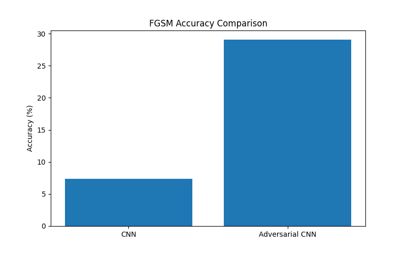
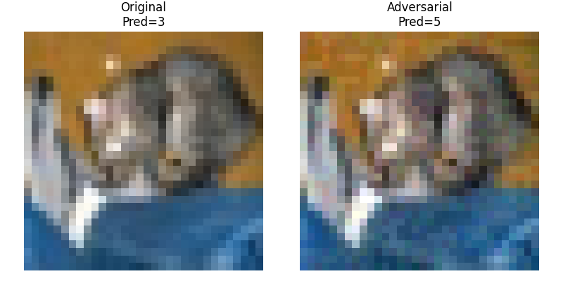
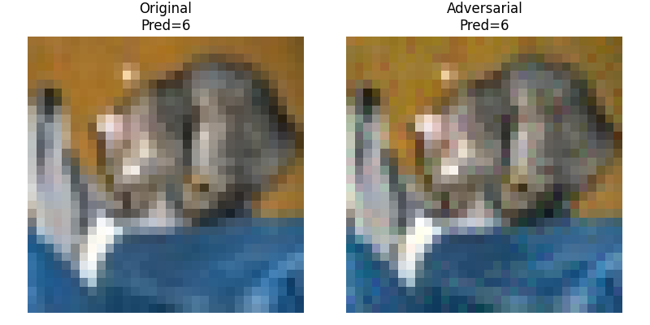

# Adversarial Attacks & Training on CIFAR-10

An experimental study of gradient-based adversarial attacks (FGSM, PGD) and adversarial training for image classification. A compact CNN is trained on CIFAR-10, attacked with imperceptible perturbations, then hardened through adversarial training.

**Author:** Gaurav Sharma — Integrated M.Tech Cyber Security, VIT Bhopal University

## Key Results

| Model | Clean Accuracy | Accuracy under FGSM (ε = 0.03) |
|---|---|---|
| Standard CNN | 72.54% | 7.34% |
| Adversarially Trained CNN | 65.15% | 28.38% |

Adversarial training trades a modest drop in clean accuracy for a **~4× improvement** in robustness at ε = 0.03.



## Project Structure

```
├── attacks/              # FGSM, PGD, and attack utilities
├── dataset/              # CIFAR-10 data (auto-downloaded if missing)
├── evaluation/           # Testing, robustness eval, confusion matrix
├── models/               # SimpleCNN architecture
├── paper/                # IEEE paper draft and research notes
├── results/              # Saved models, plots, and visualizations
└── training/             # Standard and adversarial training scripts
```

## Requirements

- Python 3.10+
- PyTorch
- Torchvision
- Matplotlib
- scikit-learn

```bash
pip install torch torchvision matplotlib scikit-learn
```

## Getting Started

Clone the repository and run scripts from the project root:

```bash
git clone https://github.com/Gaurav-Cyberbuddy/Adversarial-Project.git
cd Adversarial-Project
```

### 1. Train the baseline CNN

```bash
python training/train_model.py
```

Saves weights to `results/cnn_model.pth` after 10 epochs.

### 2. Run FGSM attack

```bash
python attacks/fgsm_attack.py
```

### 3. Train the robust model (adversarial training)

```bash
python training/adversarial_train.py
```

Saves weights to `results/adversarial_model.pth`. Uses FGSM with ε = 0.03 during training.

### 4. Evaluate

```bash
python evaluation/test_model.py          # Test baseline model
python evaluation/robust_test.py         # Test robust model
python evaluation/multi_attack_eval.py   # FGSM + PGD comparison
python evaluation/confusion_matrix.py    # Confusion matrix plot
```

### 5. Generate visualizations

```bash
python results/generate_adversarial_example.py
python results/generate_robust_adversarial_example.py
python results/plot_results.py
```

## Pre-trained Models

Trained checkpoints are included in `results/`:

- `cnn_model.pth` — standard CNN
- `adversarial_model.pth` — adversarially trained CNN

You can skip training and go straight to evaluation if you only want to reproduce attack/defense results.

## Sample Outputs

| Original vs adversarial (standard model) | Robust model under attack |
|---|---|
|  |  |

## Attacks Implemented

- **FGSM** — Fast Gradient Sign Method (single-step)
- **PGD** — Projected Gradient Descent (iterative)
- **Robust FGSM** — FGSM evaluation against the hardened model

## Research Paper

The full write-up is in [`paper/ieee_paper_draft.md`](paper/ieee_paper_draft.md), covering methodology, experimental setup, results, and security implications.

## Dataset

This project uses [CIFAR-10](https://www.cs.toronto.edu/~kriz/cifar.html) (32×32 RGB images, 10 classes). The dataset is downloaded automatically on first run via Torchvision into `dataset/`.

## License

This project is for academic and research purposes.
